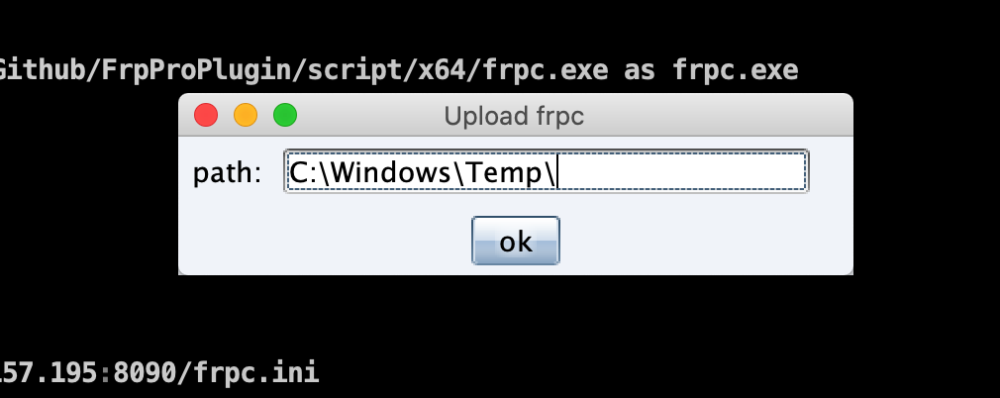
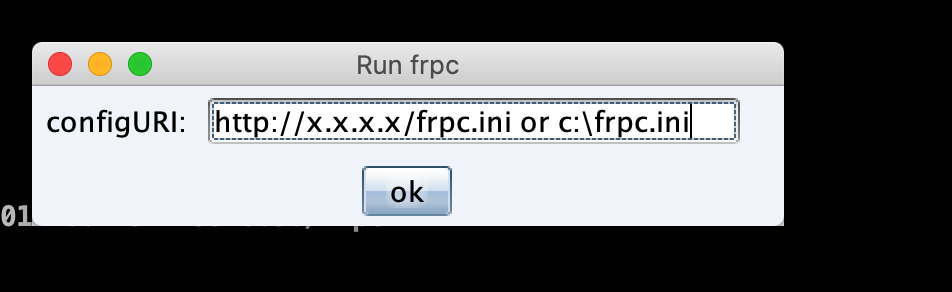
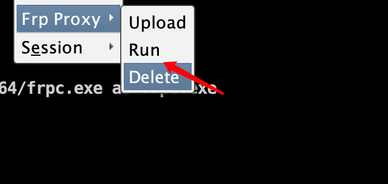
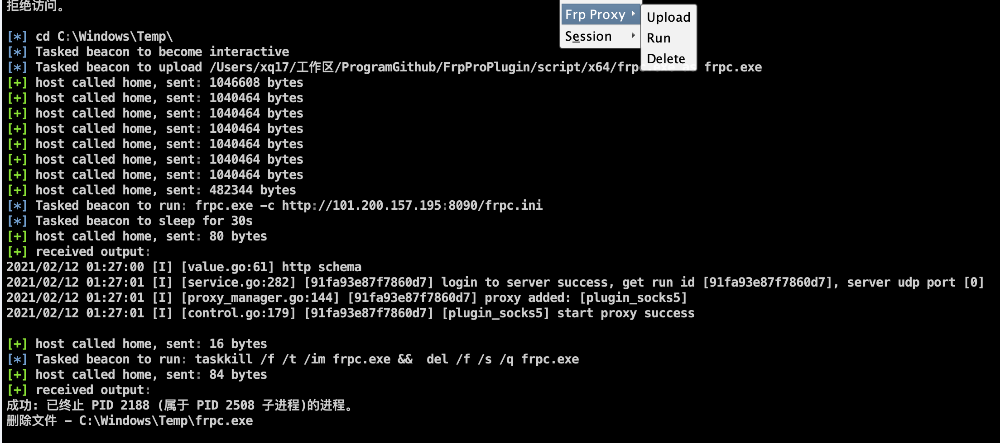

# FrpProPlugin
 frp0.33修改版,过流量检测,免杀,支持加载远程配置文件可用于cs直接使用的插件。需要服务端适配，可以在release下载对应平台的服务端。

## 更新时间线

2021.2.19 免杀更新+缩小体积


## 快速使用

服务端部署:

```
1. 下载服务端
wget https://github.com/mstxq17/FrpProPlugin/releases/download/v1.0/frp_0.33.0_linux_amd64.tar.gz
2. 解压服务端
tar -xzvf frp_0.33.0_linux_amd64.tar.gz
3. 编辑服务端配置文件
vim frps.ini
############
[common]
bind_addr = 0.0.0.0
bind_port = 7003
############
4.启动程序
tmux # 新开窗口
./frps -c frps.ini
```


客户端部署:

```
1.编辑客户端配置文件
vim frpc.ini

#############
[common]
server_addr = server_ip
server_port = 7003
protocol = tcp
tls_enable = true

[plugin_socks5]
type = tcp
remote_port = 6006
plugin = socks5
```


## 功能介绍

主要包括upload,指定frpc的位置,这里需要注意观察一下,先要确保frpc.exe完整上传了

一般要1-2分钟,需要耐心等待下



然后配置文件的URL:



最后执行完成删除frpc(自动查找进程,然后删掉文件):




## 应用效果


